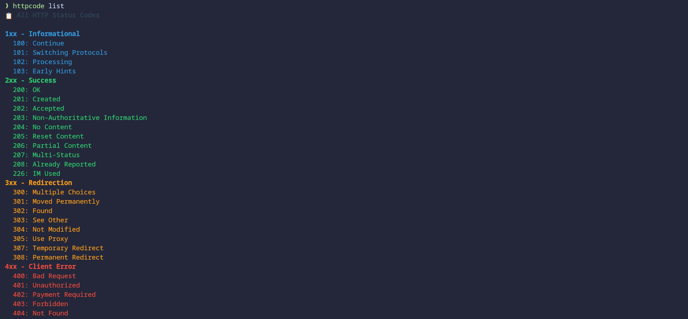

# [httpcode](https://github.com/lethang7794/httpcode)

A beautiful command-line tool for looking up HTTP status codes and their descriptions, built with Cobra and styled with Lipgloss.

## Features

- ✨ **Beautiful Terminal UI** - Styled with [Lipgloss](https://github.com/charmbracelet/lipgloss) for a modern, colorful interface
- 📋 **Comprehensive Database** - Complete HTTP status code information with detailed descriptions
- 🔍 **Multiple Lookup Options** - Look up by code or browse by category

  

- 🎯 **Interactive Fuzzy Search** - Built-in fuzzy search with fzf integration and detailed preview

  - By Status code

    

  - Or by message

    

- 🌈 **Color-Coded Categories** - Different colors for each HTTP status code category (1xx-5xx)
- 📖 **MDN Documentation Links** - Direct links to official documentation for each status code

## Installation

### Homebrew (Mac & Linux)

```bash
# Add the tap
brew tap lethang7794/tap

# Install httpcode
brew install httpcode

# Verify installation
httpcode --help
```

### Go Install

```bash
# Install latest version
go install github.com/lethang7794/httpcode@latest

# Install specific version
go install github.com/lethang7794/httpcode@v1.0.0
```

### Download Binary

Download the appropriate binary for your platform from the [latest release](https://github.com/lethang7794/httpcode/releases/latest).

### Build from Source

First, make sure you have Go installed on your system. Then, you can build the tool by running:

```bash
# Clone the repository
git clone https://github.com/lethang7794/httpcode.git
cd httpcode

# Build the binary
go build -o httpcode

# Optionally, move the binary to a directory in your PATH
sudo mv httpcode /usr/local/bin/
```

## Usage

```
httpcode                 - Interactive fuzzy search (equivalent to httpcode search)
httpcode <code>          - Look up a specific HTTP status code
httpcode list            - List all HTTP status codes
httpcode list <category> - List codes by category (1xx, 2xx, 3xx, 4xx, 5xx)
httpcode search          - Interactive fuzzy search with detailed preview
httpcode help            - Show help message
```

> [!NOTE]
> Running `httpcode` without any arguments is equivalent to running `httpcode search` - both will launch the interactive fuzzy search interface.

## Beautiful Output

The tool uses Lipgloss to provide beautiful, color-coded output:

- 🔵 **1xx (Informational)** - Blue styling
- 🟢 **2xx (Success)** - Green styling
- 🟠 **3xx (Redirection)** - Orange styling
- 🔴 **4xx (Client Error)** - Red styling
- 🟣 **5xx (Server Error)** - Purple styling

Each status code is displayed with:

- Styled header with code and description
- Category badge
- Detailed explanation in a clean format
- Clickable MDN documentation link
- Beautiful color coding and alignment

## Detailed Information

For each HTTP status code, the tool provides:

- Short description
- Detailed explanation
- Link to MDN documentation
- Color-coded category classification

## Interactive Search

The tool includes built-in interactive fuzzy search functionality:

```bash
# Interactive fuzzy search with detailed preview
httpcode
# or
httpcode search
```

The fuzzy search interface allows you to:

- Type to filter HTTP status codes
- View detailed information in the preview pane

  

- Use arrow keys to navigate

  

- Press Enter to select a code

  

- Press Ctrl+C or Esc to exit

## Shell Completion

The tool supports shell completion for bash, zsh, fish, and PowerShell:

```bash
# Bash
source <(httpcode completion bash)

# Zsh
httpcode completion zsh > "${fpath[1]}/_httpcode"

# Fish
httpcode completion fish > ~/.config/fish/completions/httpcode.fish

# PowerShell
httpcode completion powershell | Out-String | Invoke-Expression
```

To install completions permanently, see the output of `httpcode completion --help`.

## Examples

```bash
# Interactive fuzzy search (default behavior)
httpcode

# Look up a specific status code with beautiful styling
httpcode 404

# List all 4xx (client error) status codes with color coding
httpcode list 4xx

# Interactive fuzzy search with preview (same as above)
httpcode search

# List all codes with beautiful category headers
httpcode list
```

## CI/CD and Releases

The project uses a unified GitHub Actions workflow for continuous integration and automated releases:

### Workflow

- **CI/CD Pipeline** (`.github/workflows/ci-cd.yml`) - Single workflow handling everything
  - **On Pull Requests**: Runs tests only
  - **On Main Branch Push**: Full pipeline (test → tag → release)
  - **Go Version**: 1.23.0
  - **Coverage Reports**: Uploaded to Codecov
  - **GoReleaser Integration**: Automated building and releasing

### Pipeline Flow

```
1. 🧪 Run Tests (Go 1.23.0)
   ├─ If tests fail → Stop pipeline
   └─ If tests pass → Continue

2. 🏷️ Create Tag (only on main branch)
   ├─ Analyze commits since last tag
   ├─ Determine version bump (major/minor/patch)
   ├─ Calculate new version
   ├─ Create and push Git tag
   └─ If tag creation fails → Stop pipeline

3. 🚀 Run GoReleaser (only if tag was created)
   ├─ Build cross-platform binaries
   ├─ Create GitHub release
   ├─ Upload assets
   └─ Generate changelog
```

### Semantic Versioning

Version bumps are determined by commit message prefixes:

- `feat:` or `feature:` → **Minor** version bump (new features)
- `fix:` or `bug:` → **Patch** version bump (bug fixes)
- `breaking:` or `!:` → **Major** version bump (breaking changes)
- `docs:`, `style:`, `refactor:`, `test:`, `chore:` → **Patch** version bump

### Release Process

1. **Commit with conventional message**: `feat: add new search feature`
2. **Push to main**: Triggers unified CI/CD pipeline
3. **Tests run**: Ensures code quality on Go 1.23.0
4. **Tag created**: Based on semantic versioning (e.g., v1.1.0)
5. **GoReleaser runs**: Builds and releases automatically

### Release Assets

Each release includes:

- Cross-platform binaries (Linux, macOS, Windows - amd64, arm64)
- Archives (tar.gz, zip)
- Checksums for verification
- Auto-generated changelog

### Contributing

See [CONTRIBUTING.md](../.github/CONTRIBUTING.md) for development setup and contribution guidelines.

## Testing

The project includes comprehensive tests for all subcommands and functionality:

```bash
# Run all tests
go test ./cmd/...

# Run tests with coverage
go test -cover ./cmd/...

# Run the test suite with detailed output
chmod +x scripts/run_tests.sh
./scripts/run_tests.sh
```

### Test Coverage

- **Root Command Tests** (`cmd/root_test.go`) - Tests argument parsing and code lookup
- **List Command Tests** (`cmd/list_test.go`) - Tests listing functionality and categories
- **Search Command Tests** (`cmd/search_test.go`) - Tests search command structure and helpers
- **Display Tests** (`cmd/display_test.go`) - Tests Lipgloss styling functions
- **HTTP Codes Tests** (`cmd/codes_test.go`) - Tests HTTP status code data integrity

## Dependencies

- [Cobra](https://github.com/spf13/cobra) - CLI framework
- [Lipgloss](https://github.com/charmbracelet/lipgloss) - Terminal styling
- [fzf](https://github.com/junegunn/fzf) - Fuzzy search functionality

## Demo

Run the demo script to see the beautiful styling in action:

```bash
chmod +x scripts/demo.sh
./scripts/demo.sh
```

## Acknowledgments

**AI-Assisted Development**: Approximately 70% of this project was developed with the assistance of Amazon Q CLI using Claude 3.5 Sonnet. This includes code generation, testing, documentation, and CI/CD pipeline setup.

## License

[MIT](../LICENSE)
